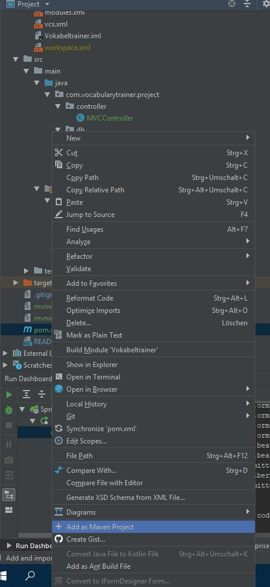

# Configuring the Project 

## Setup Instructions

### Requirements

* Java SDK 1.8 or higher
* JDK 8 or higher
* MySQL 5.6 or higher
* JetBrains IntelliJ Ultimate IDE (optional but recommended)
    * alternatively, you can skip this and just build and start the application in a terminal, typing the following:
        
        ```
        $ cd $PROJECT_ROOT_DIR/
        $ mvn package
        $ cd target/
        $ java -jar target/project-0.0.1-SNAPSHOT.jar
        ```
        
    * <b>But</b> make sure that you edited your [MySQL configurations](#adding-mysql-to-our-project) beforehand.

### Building and Running

* Clone/Download this repository 
* Start IntelliJ and click 'Open'
* Navigate in your cloned repo folder, choose the `pom.xml` file and click 'ok'
* After prompted 'pom.xml is a project file' click 'Open as Project'
* Before you run the project, configure [MySQL](#adding-mysql-to-our-project).
* To start the application hit the green 'play button' (VocabularyTrainerApplication selected), the spring boot application will start (see Run)
  * Alternatively, you can also right-click on `VocabularyTrainerApplication.java` and click 'Run'  
* Navigate in your Browser to the home url: [http://localhost:8080](http://localhost:8080)

#### Adding MySQL to our Project

* Download and Install MySQL [Community](https://dev.mysql.com/downloads/mysql/) and [Workbench](https://www.mysql.com/products/workbench/), setup everything 
in the workbench (create user `student` and password `student` for simplicity)
 and start the server (default port is 3306).

* Add the following to `src/recources/application.properties`:

    ```
    spring.jpa.hibernate.ddl-auto=update
    spring.datasource.url=jdbc:mysql://${MYSQL_HOST:localhost}:3306/db_vocabularies
    spring.datasource.username=student
    spring.datasource.password=student
    ```

* (Replace `username` and `password` with your MySQL configuration if your credentials differ).

# Project Overview

## Project Skeleton

__Note__: user specific files (.idea, project.iml) and directories (target/) are not included and ignored (.gitignore).
```
src
 +- main
 |   +- resources
 |   |   +- templates
 |   |   |   +- index.html
 |   |   |   |
 |   |   |   +- login.html
 |   |   |   |
 |   |   |   +- access-denied-page.html
 |   |   |   |
 |   |   |   +- user
 |   |   |       +- index.html
 |   |   |       |
 |   |   |       +- addvoc_form.html
 |   |   |
 |   |   +- static
 |   |   |   +- style.css 
 |   |   |
 |   |   +- application.properties
 |   +- java
 |       +-com
 |          +- vocabularytrainer
 |              +- project
 |                  +- VocabularyTrainerApplication.java
 |                  |
 |                  +- db
 |                  |   +- VocabularyAddEntries.java
 |                  |   +- VocabularyRepository.java
 |                  |
 |                  +- controller
 |                  |   +- MVCController.java
 |                  |
 |                  +- security
 |                      +- SpringSecurityLogin.java 
 +- test     
 |   +- java
 |       +- com
 |           +- vocabularytrainer
 |               +- project
 |                   +- VocabularyTrainerApplicationTests.java
 |
 +- docs
 |   +- Documentation.md
 |   |
 |   +- fix_cannot_build.jpeg
 |
 +- .gitignore
 |
 +- mvnw
 |
 +- mvnw.cmd
 |
 +- pom.xml
 |
 +- README.md
 
```

## `pom.xml` configuration and dependencis

```xml
<?xml version="1.0" encoding="UTF-8"?>
<project xmlns="http://maven.apache.org/POM/4.0.0" xmlns:xsi="http://www.w3.org/2001/XMLSchema-instance"
	xsi:schemaLocation="http://maven.apache.org/POM/4.0.0 https://maven.apache.org/xsd/maven-4.0.0.xsd">
	<modelVersion>4.0.0</modelVersion>
	<parent>
		<groupId>org.springframework.boot</groupId>
		<artifactId>spring-boot-starter-parent</artifactId>
		<version>2.2.5.RELEASE</version>
		<relativePath/> <!-- lookup parent from repository -->
	</parent>
	<groupId>com.vocabularytrainer</groupId>
	<artifactId>project</artifactId>
	<version>0.0.1-SNAPSHOT</version>
	<name>vocabulary-trainer</name>
	<description>A Vocabulary Trainer Web Application.</description>

	<properties>
		<java.version>1.8</java.version>
	</properties>

    <dependencies>

        <dependency>
            <groupId>org.springframework.boot</groupId>
            <artifactId>spring-boot-starter-data-jpa</artifactId>
        </dependency>

        <dependency>
            <groupId>org.springframework.boot</groupId>
            <artifactId>spring-boot-starter-web</artifactId>
        </dependency>

        <dependency>
            <groupId>org.springframework.boot</groupId>
            <artifactId>spring-boot-starter-test</artifactId>
            <scope>test</scope>
            <exclusions>
                <exclusion>
                    <groupId>org.junit.vintage</groupId>
                    <artifactId>junit-vintage-engine</artifactId>
                </exclusion>
            </exclusions>
        </dependency>

        <dependency>
            <groupId>mysql</groupId>
            <artifactId>mysql-connector-java</artifactId>
            <scope>runtime</scope>
        </dependency>


        <dependency>
            <groupId>org.springframework.boot</groupId>
            <artifactId>spring-boot-starter-thymeleaf</artifactId>
        </dependency>


        <dependency>
            <groupId>org.springframework.boot</groupId>
            <artifactId>spring-boot-devtools</artifactId>
        </dependency>


        <dependency>
            <groupId>org.springframework.boot</groupId>
            <artifactId>spring-boot-starter-security</artifactId>
        </dependency>


        <!--
        <dependency>
            <groupId>org.thymeleaf.extras</groupId>
            <artifactId>thymeleaf-extras-springsecurity4</artifactId>
        </dependency>
        -->

    </dependencies>

	<build>
		<plugins>
			<plugin>
				<groupId>org.springframework.boot</groupId>
				<artifactId>spring-boot-maven-plugin</artifactId>
			</plugin>
		</plugins>
	</build>

</project>
```

# Troubleshooting

### Fix, if you can't build the project (after pulling)




### Useful Spring Boot, Thymeleaf, Bootstrap Get Started-Links


